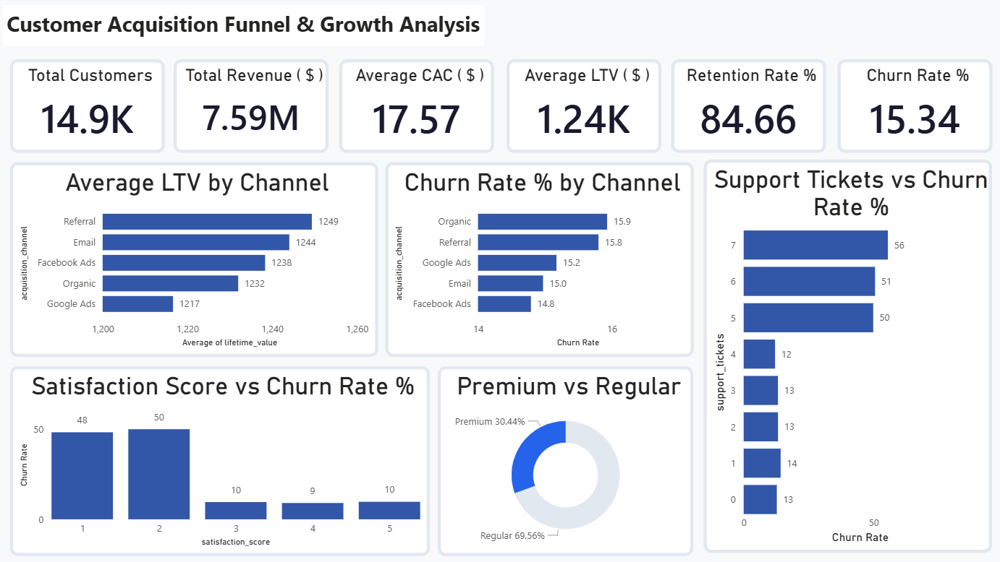

# Customer Acquisition Funnel & Growth Analysis
### Nexora | Growth Analytics Project

**Diagnosing Customer Acquisition Efficiency and Retention Drivers Across 5 Digital Channels for a B2C SaaS Platform**



---

## Table of Contents
1. [Project Background](#project-background)
2. [Data Structure & Initial Checks](#data-structure--initial-checks)
3. [Executive Summary](#executive-summary)
4. [Insights Deep Dive](#insights-deep-dive)
5. [Recommendations](#recommendations)
6. [Assumptions & Caveats](#assumptions--caveats)
7. [Technical Stack](#technical-stack)
8. [Repository Structure](#repository-structure)

---

## Project Background

Nexora is a B2C SaaS platform offering subscription-based productivity tools to individual and business users across global markets. The platform operates on two subscription tiers (Monthly and Annual) with a Premium upgrade option, acquiring customers through five digital channels: Organic Search, Google Ads, Facebook Ads, Email Campaigns, and Referral Programs.

Despite consistent customer acquisition activity across all five channels, Nexora's growth team identified two persistent problems entering FY 2025: churn rates were higher than industry benchmarks and channel-level ROI was unclear, making budget allocation decisions largely intuition-driven rather than data-backed.

This project was undertaken to build a complete data-driven picture of Nexora's customer acquisition funnel, from the moment a customer is acquired to whether they stay or leave, and to identify the levers that most significantly impact retention and lifetime value.

Insights and recommendations are provided across four key areas:

- **Acquisition Channel ROI:** Which channels deliver the highest lifetime value customers relative to acquisition cost, and where is spend being wasted?
- **Churn Drivers:** What behavioral and experiential signals most strongly predict whether a Nexora customer will churn?
- **Revenue Segmentation:** Which customer segments (Premium vs Regular, Annual vs Monthly) generate the most value and retain best?
- **Engagement Patterns:** How do visit behavior, session time, and email engagement connect to actual spending and retention outcomes?

The Python cleaning and feature engineering script is [here](funnel_ans_cleaning.ipynb).

The full SQL analysis report with query screenshots and findings is [here](SQL_Analysis_Report.pdf).

Individual query result exports are in the [query_results](query_results/) folder.

The interactive Power BI dashboard file is [here](dashboard/Customer_Acquisition_Funnel_Analysis.pbix).

---

## Data Structure & Initial Checks

The analysis is built on Nexora's CRM and digital marketing dataset covering 15,000 customer records across 30 fields, spanning signup dates from January 2022 through September 2024.

| Detail | Info |
|---|---|
| Raw rows | 15,000 |
| Rows after cleaning | 14,900 |
| Original columns | 30 |
| Final columns | 35 |
| Acquisition channels | Organic, Google Ads, Facebook Ads, Email, Referral |
| Subscription types | Monthly, Annual |
| Target variable | `churn` (1 = churned, 0 = active) |

The dataset covers customer demographics, behavioral engagement metrics, transactional records, marketing spend per user, satisfaction scores, NPS scores, and support ticket history. It includes real-world data quality issues including missing values, outliers, inconsistent date formats, and class imbalance in the churn variable (approximately 85% active, 15% churned).

Before analysis, the following data quality decisions were made:

- **City column removed:** City and country values were mismatched throughout the raw data, with customers from one country mapped to cities in entirely different countries. City-level analysis would have produced misleading regional insights, so the column was dropped entirely and country was retained.
- **Negative and extreme ages removed:** The age column contained negative values and entries above 90. Both are implausible for real Nexora users and were treated as data entry errors. These were removed before filling remaining nulls with the median age.
- **Missing values treated by column context:** Numeric columns with missing values were filled with the median rather than mean, since spending and satisfaction data in SaaS is typically right-skewed by power users. Missing coupon codes were filled with 'NO COUPON' as their absence simply indicates no coupon was applied at signup.
- **Never purchased flag created:** Customers with no last purchase date were not dropped. A binary flag `never_purchased` was created to distinguish customers who signed up but never converted to a paid plan from those who subscribed and later churned. These represent fundamentally different business problems — one is an activation failure, the other is a retention failure.

---

## Executive Summary

### Overview of Findings

Nexora's five acquisition channels spend nearly identically to acquire customers, with average CAC ranging only from $17.22 (Organic) to $17.82 (Referral). However what happens after acquisition varies significantly across channels and customer segments. Referral and Email channels produce the highest lifetime value customers at $1,249 and $1,244 respectively, while Google Ads sits lowest at $1,217.

The most significant finding in the entire analysis is not channel-related. Satisfaction score is the single strongest predictor of churn across Nexora's customer base. Customers scoring 1 or 2 on satisfaction churn at 48 to 50 percent. Customers scoring 3 or above churn at only 9 to 10 percent. That 40 percentage point cliff means the difference between a dissatisfied and a neutral customer is a 5x difference in churn probability. Support ticket volume above 4 is the second strongest churn signal, with churn rates jumping from 13 percent to above 50 percent at 5 or more tickets.

For Nexora's growth and customer success teams, the data clearly point to one conclusion: acquisition cost is not the problem. What happens after acquisition is.


*The interactive Power BI dashboard can be downloaded [here](dashboard/Customer_Acquisition_Funnel_Analysis.pbix).*

---

## Insights Deep Dive

### Acquisition: Equal Spend, Unequal Returns

- All five channels acquire customers at nearly identical cost, with CAC ranging from $17.22 to $17.82 — a difference of only $0.60 across the entire channel mix. Acquisition cost alone cannot differentiate channel quality for Nexora.
- Referral produces the highest average LTV at $1,249.37 and Email follows at $1,244.05, while Google Ads sits lowest at $1,216.61 — a $32 gap between best and worst performing channels on lifetime value.
- The LTV to CAC ratio tells the clearest story: Organic leads at 71.53x return per dollar spent, followed by Email at 70.72x and Referral at 70.12x. Google Ads trails at 69.38x.
- Organic's high ratio is undermined by its churn rate. The LTV figure for Organic customers is not being fully realized because a disproportionate share of them leave before generating that value.

### Churn: Two Signals Dominate Everything Else

- Customers with a satisfaction score of 1 churn at 48.46% and score 2 at 50.17%. Customers scoring 3, 4, and 5 churn at 9.61%, 9.09%, and 9.76% respectively. The gap between score 2 and score 3 is not gradual — it is a cliff. Churn drops by more than 40 percentage points between a dissatisfied and a neutral customer.
- Support tickets show a clear threshold effect. At 0 to 4 tickets, churn stays between 12% and 14%. At 5 tickets it jumps to 49.91%, at 6 to 50.61%, and at 7 to 55.56%. Customers with 5 or more open tickets are in a high-risk churn zone that standard support queues are not equipped to handle.
- Organic channel has the highest churn at 15.93%, followed by Referral at 15.80%. Facebook Ads has the lowest at 14.79%. The spread across channels is relatively narrow (roughly 1 percentage point), confirming that channel of acquisition is a weaker churn predictor than satisfaction experience and support quality.

### Revenue: Segment Differences Are Smaller Than Expected

- Premium users (4,536 customers, 30.44% of base) have avg spend of $512.05 and avg LTV of $1,241.17 versus regular users at $508.14 and $1,233.62. The gap exists but is narrower than expected for a premium tier, suggesting Nexora's premium offering may not be sufficiently differentiated in terms of value delivered.
- Monthly subscribers slightly outspend Annual subscribers on avg ($506.33 vs $512.46) but Annual subscribers have meaningfully lower churn (15.10% vs 15.57%), making Annual customers more stable and predictable over time.
- Discount users and non-discount users show nearly identical LTV ($1,239.22 vs $1,232.69), indicating that Nexora's discount strategy is not eroding long-term customer value — a positive finding for the pricing team.
- Organic channel generates the highest total revenue at $1,559,419 driven by slightly higher customer volume, not higher per-customer spending.

### Engagement: Uniform Across Channels, Visit Volume Has Limits

- All five channels produce an identical average engagement score of 0.47, with avg visits ranging from 14.9 to 15.2 and avg session times between 7.9 and 8.1 minutes. Engagement behavior at Nexora is driven by individual customer patterns, not by acquisition source.
- Medium visit customers (20 to 50 visits) have higher avg spend ($515.10) than low visit customers ($508.51), but the high and very high visit segments are not represented in the data, suggesting almost all of Nexora's 14,900 customers fall under 50 visits. Visit frequency alone is not a reliable spending predictor.
- Desktop generates the highest avg revenue per visit at $36.84, followed by Tablet at $36.54 and Mobile at $36.35. The difference is marginal across device types.

---

## Recommendations

Based on the analysis conducted across Nexora's 14,900 customer records, the following actions are recommended for the growth, product, and customer success teams:

- **Build a dedicated onboarding sequence for Organic channel customers.** Organic has the best LTV to CAC ratio on paper but the highest churn rate in practice. Nexora is acquiring these customers at the lowest cost and then losing them at the highest rate. A structured first-week email or in-app walkthrough sequence targeted specifically at organic signups could close this gap without requiring additional acquisition spend. The goal is to get organic customers to their first value moment faster.

- **Implement automated satisfaction score monitoring with intervention triggers.** The churn cliff between score 2 and score 3 is the single highest-leverage data point in this entire project. An automated alert that flags any customer dropping to a satisfaction score of 2 or below and triggers a proactive outreach from the customer success team could have an outsized impact on overall retention. Catching customers at score 2 before they become score 1 churners is where the biggest retention gains are available.

- **Escalate customers with 5 or more support tickets immediately.** The data shows a sharp churn threshold at exactly 5 tickets. Customers at this point should be automatically routed to a senior support tier or dedicated customer success manager rather than continuing through standard resolution queues. The cost of one escalation is significantly lower than the cost of losing a customer with $1,240 average LTV.

- **Invest more in Referral program infrastructure.** Referral produces Nexora's highest LTV customers at $1,249 at a CAC comparable to all other channels. Introducing structured referral incentives such as account credits or feature unlocks for existing customers who successfully refer new subscribers creates a compounding acquisition loop. The best customers bring in customers like themselves.

- **Redesign the Premium tier value proposition.** The LTV gap between Premium and Regular users ($1,241 vs $1,234) is narrower than it should be for a premium product tier. If premium users are not significantly outspending or out-retaining regular users, the tier may not be delivering enough differentiated value to justify the upgrade. A targeted upgrade campaign for high-engagement regular users should be paired with a review of what Premium actually offers.

- **Target high-visit low-spend customers with conversion nudges.** The engagement data shows that visiting frequently does not reliably translate to spending more. Customers with above-average visits but below-average spend represent an unconverted engaged audience. Exit-intent offers, personalized product recommendations, or time-limited upgrade prompts targeted at this segment could convert existing engagement into incremental revenue without acquiring a single new customer.

---

## Assumptions & Caveats

- **Company context is illustrative:** Nexora is a fictional company created to provide business context for this analysis. The dataset is synthetic, generated to simulate real CRM and digital marketing patterns. Findings are directionally valid but should not be treated as production business intelligence.

- **City column exclusion:** City and country values were mismatched in the raw data. The city column was dropped entirely. No city-level analysis is possible with this dataset.

- **CAC definition:** The dataset provides `marketing_spend_per_user` as a direct field, treated as CAC throughout. In a real business context, CAC would include additional cost inputs beyond media spend such as sales team costs and creative production.

- **Engagement score is a derived metric:** The engagement score was engineered as a weighted combination of total visits (40%), avg session time (30%), and email open rate (30%). Weights reflect analytical judgment and are not derived from a statistical model. Different weights would produce different scores.

- **Satisfaction score missing values:** 702 satisfaction scores were missing and filled with the dataset median. This may slightly compress the distribution and understate the true prevalence of very low satisfaction scores in Nexora's customer base.

- **Reference date for recency columns:** Days since last purchase and customer tenure were calculated using April 1, 2025 as a reference date aligned with the dataset's latest activity period.

- **Informal and indirect revenue excluded:** This analysis covers only direct customer spending captured in the CRM. Any revenue from enterprise contracts, partnerships, or indirect channels is not reflected in these figures.

---

## Technical Stack

| Tool | Purpose |
|---|---|
| Python (Pandas, NumPy, Matplotlib) | Data cleaning, feature engineering, and outlier visualization |
| Google Colab | Cloud-based processing environment used to avoid local hardware constraints |
| MySQL Workbench | SQL-based analysis across 15 structured queries |
| Excel | Pivot tables and channel comparison summaries |
| Power BI Desktop | Interactive single-page dashboard covering acquisition, churn, and revenue |
| Git and GitHub | Version control and portfolio hosting |

---

## Repository Structure

```
customer-acquisition-funnel-analysis/
│
├── funnel_ans_cleaning.ipynb                   # Python data cleaning and feature engineering script
├── analysis_queries.sql                        # All 15 SQL queries with section comments
├── funnel_clean_data.csv                       # Final cleaned dataset (14,900 rows, 35 columns)
├── SQL_Analysis_Report.pdf                     # Full query results with screenshots and findings
├── Customer_Acquisition_Funnel_Analysis.pbix   # Power BI dashboard file
├── dashboard_.png                              # Dashboard screenshot
├── README.md                                   # Project documentation
│
└── query_results/                              # Individual CSV exports for each SQL query
    ├── Q01_customers_by_channel.csv
    ├── Q02_avg_CAC_by_channel.csv
    ├── Q03_avg_LTV_by_channel.csv
    ├── Q04_LTV_CAC_ratio_by_channel.csv
    ├── Q05_overall_churn_rate.csv
    ├── Q06_churn_by_channel.csv
    ├── Q07_satisfaction_vs_churn.csv
    ├── Q08_support_tickets_vs_churn.csv
    ├── Q09_revenue_by_channel.csv
    ├── Q10_premium_vs_regular.csv
    ├── Q11_annual_vs_monthly.csv
    ├── Q12_discount_vs_LTV.csv
    ├── Q13_engagement_by_channel.csv
    ├── Q14_visits_vs_spend.csv
    └── Q15_revenue_per_visit_by_device.csv
```

---

## Contact

**Aditya Attri**
- GitHub: [Aditya Attri](https://github.com/adityaattri19/)
- LinkedIn: [Aditya Attri](https://www.linkedin.com/in/aditya-attri19/)
